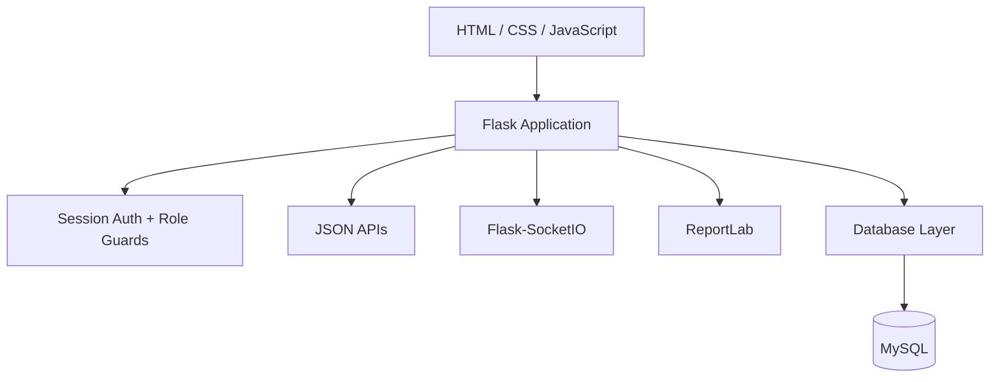

<div align="center">

# Bristol City Events — Full-Stack Event Management Platform

### Discover events. Book tickets. Manage venues. Track revenue. Run the entire event operation from one Flask application.


**BCE** is a full-stack event booking and administration system built around Flask + MySQL, realtime booking updates, role-based access control, ticket inventory, waiting lists, PDF receipts, and operational analytics.

</div>

## Core capabilities

- Event discovery and filtering
- Registration, login and session authentication
- Role-based user/admin dashboards
- Capacity-aware ticket booking
- Waiting-list fallback
- Booking cancellation and refunds
- PDF receipt generation
- Flask-SocketIO realtime booking updates
- Event, venue and category administration
- User and role management
- Revenue, booking and venue analytics

## Architecture



## Production deployment

The production build is configured for Render with Gunicorn. Runtime secrets and MySQL credentials must be provided through environment variables.

```env
FLASK_SECRET_KEY=change-me
DB_HOST=your-host
DB_PORT=3306
DB_USER=your-user
DB_PASSWORD=your-password
DB_NAME=bce_event_system
```

## Author

**Edgar Charles Omondi**  
GitHub: [@Edgar-50](https://github.com/Edgar-50)
