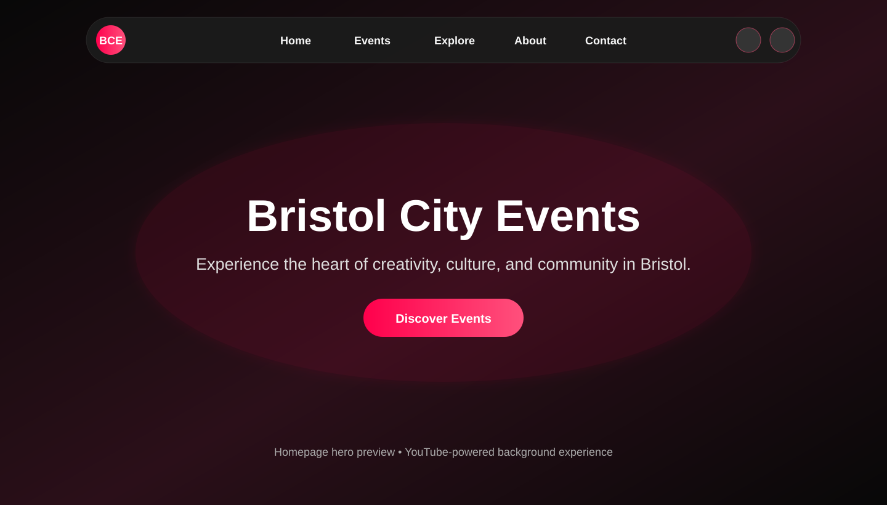
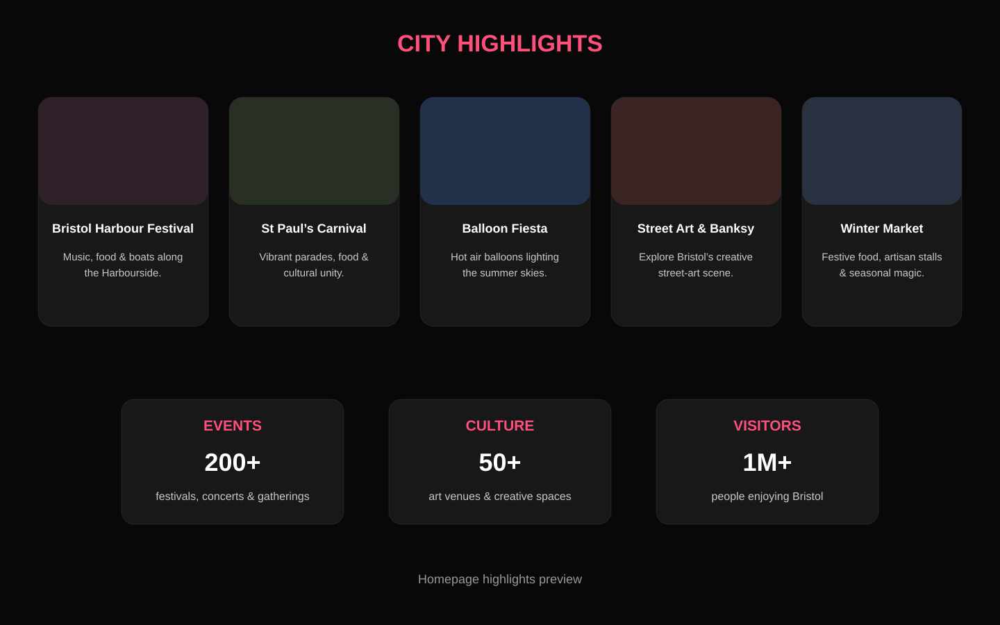
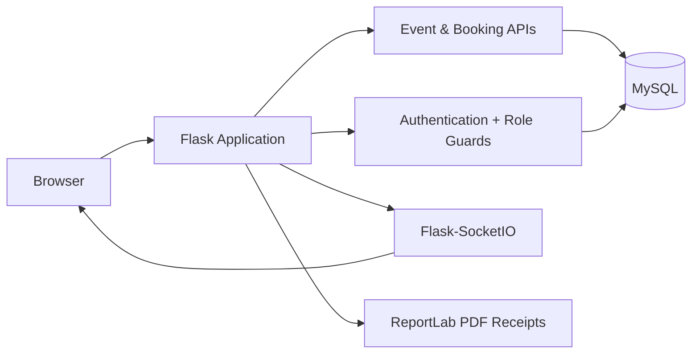

<div align="center">

# Bristol City Events

### Full-stack event discovery, booking, administration and analytics platform for Bristol.

[](#)
[](#)
[](#)
[](#)
[](https://bristol-city-events.onrender.com)

**BCE** brings event discovery, ticketing, user accounts, admin operations, receipts, waiting lists and reporting into one Flask application.

## 🌐 Live Production Deployment

### **[Launch Bristol City Events →](https://bristol-city-events.onrender.com)**

**Production URL:** https://bristol-city-events.onrender.com  
**Repository:** https://github.com/Edgar-50/Bristol-City-Events  
**Runtime:** Python 3.12 + Gunicorn on Render  
**Project status:** Active development / production deployment

</div>

---

## Homepage Preview

### Hero experience

<p align="center">
  
</p>

### City highlights

<p align="center">
  
</p>

The homepage combines the pill-style navigation, a cinematic YouTube-powered hero background, event discovery CTA, Bristol highlights, event statistics and responsive dark/light presentation.

---

## What BCE Does

Bristol City Events is more than a static event listing page. The application provides a complete workflow around discovering, booking and operating events.

| Area | Capability |
|---|---|
| Event discovery | Browse and explore Bristol events |
| Authentication | Registration, login and session-based access |
| Booking | Capacity-aware booking flow |
| Waiting lists | Queue users when events reach capacity |
| User dashboard | View bookings and account activity |
| Admin dashboard | Manage users, events and operational data |
| Realtime | Flask-SocketIO booking updates |
| Receipts | PDF receipt generation with ReportLab |
| Reporting | Booking, revenue and event analytics |
| Database | MySQL integration through PyMySQL |

---

## Architecture



### Application layers

```text
Bristol-City-Events/
├── app.py
├── config.py
├── requirements.txt
├── db/
│   ├── connection.py
│   ├── user_model.py
│   ├── event_model.py
│   └── booking_model.py
├── templates/
│   ├── index.html
│   ├── events.html
│   ├── explore.html
│   ├── login.html
│   ├── userpanel.html
│   ├── admin.html
│   ├── reports.html
│   └── receipt.html
├── static/
│   ├── css/
│   ├── js/
│   └── assets/
└── docs/
    └── screenshots/
```

---

## Implemented Platform Capabilities

BCE has evolved beyond a basic events CRUD application into a broader event-discovery, ticketing and operations platform.

### 🎟️ Event discovery & booking
- Bristol-focused event discovery and featured-event experiences.
- Capacity-aware event booking workflow.
- Waiting-list handling for fully booked events.
- Booking cancellation workflow.
- Ticket and availability state management.
- Responsive event browsing across desktop and mobile layouts.

### 👤 User experience
- User registration and secure login.
- Session-based authentication.
- Personal user dashboard.
- Booking history and account activity views.
- PDF receipt generation for completed bookings.
- Light and dark presentation modes.

### 🛡️ Administration & operations
- Protected administrative routes.
- Advanced admin dashboard.
- User and role management.
- Event CRUD and operational event management.
- Venue/category-oriented management tools.
- Booking oversight and capacity monitoring.
- Revenue, booking and event reporting.

### ⚡ Realtime & interactive features
- Flask-SocketIO realtime updates.
- Interactive Bristol exploration experience.
- Dynamic frontend behaviour with JavaScript.
- Community-oriented **Connect & Discover** experience.
- Cinematic homepage presentation using a hosted YouTube hero source instead of storing a ~269 MB video in Git.

### 📊 Analytics & reporting
- Booking analytics.
- Revenue reporting.
- Event performance reporting.
- Operational dashboard views.
- PDF receipt/document generation with ReportLab.

### 🚀 Production engineering
- Gunicorn production server configuration.
- Render deployment.
- Environment-based secret configuration.
- `.gitignore` protection for local/runtime files.
- GitHub-based source control and deployment workflow.
- Large binary media removed from Git workflow in favour of hosted media.

---

## AI-Assisted Development

AI-assisted engineering tools were used as part of the BCE development workflow for tasks such as debugging, code review, refactoring, deployment troubleshooting, dependency correction, documentation, security cleanup and Git/GitHub workflow optimisation.

AI support is used as an engineering accelerator rather than a replacement for project ownership. Architecture, feature direction, integration decisions, testing choices and final implementation remain part of the BCE development process.

### Development areas supported by AI tooling
- Debugging Flask routes and application behaviour.
- Reviewing backend/frontend integration.
- Refactoring and maintainability improvements.
- Deployment and Render troubleshooting.
- Dependency and runtime compatibility checks.
- Git/GitHub workflow assistance.
- README and technical documentation refinement.
- Security hygiene such as environment-variable migration and secret cleanup.

---

## Current Implementation Status

| Capability | Status |
|---|---|
| Full-stack Flask application | ✅ Implemented |
| MySQL / PyMySQL data layer | ✅ Implemented |
| Registration & login | ✅ Implemented |
| Session authentication | ✅ Implemented |
| Role-based user/admin access | ✅ Implemented |
| User dashboard | ✅ Implemented |
| Admin dashboard | ✅ Implemented |
| Event management | ✅ Implemented |
| Booking workflow | ✅ Implemented |
| Waiting-list workflow | ✅ Implemented |
| Booking cancellation flow | ✅ Implemented |
| PDF receipts | ✅ Implemented |
| Flask-SocketIO realtime updates | ✅ Implemented |
| Reporting & analytics | ✅ Implemented |
| Interactive Bristol exploration | ✅ Implemented |
| Responsive light/dark UI | ✅ Implemented |
| YouTube-hosted cinematic hero | ✅ Implemented |
| Gunicorn production configuration | ✅ Implemented |
| Render deployment | ✅ Live |

---

## Tech Stack

**Backend:** Python, Flask, Werkzeug  
**Database:** MySQL, PyMySQL  
**Realtime:** Flask-SocketIO, Simple-WebSocket  
**Documents:** ReportLab  
**Frontend:** HTML5, CSS3, JavaScript  
**Production server:** Gunicorn  
**Deployment:** Render  
**Version control:** Git + GitHub

---

## Local Development

### 1. Clone

```bash
git clone https://github.com/Edgar-50/Bristol-City-Events.git
cd Bristol-City-Events
```

### 2. Create a virtual environment

```bash
python -m venv .venv
```

Windows:

```powershell
.\.venv\Scripts\Activate.ps1
```

macOS/Linux:

```bash
source .venv/bin/activate
```

### 3. Install dependencies

```bash
pip install -r requirements.txt
```

### 4. Configure environment variables

```env
FLASK_SECRET_KEY=replace-with-a-secure-random-value
DB_HOST=localhost
DB_PORT=3306
DB_USER=your_mysql_user
DB_PASSWORD=your_mysql_password
DB_NAME=bce_event_system
```

### 5. Start BCE

```bash
python app.py
```

Then open:

```text
http://127.0.0.1:5000
```

---

## Production

The Render service uses:

```bash
pip install -r requirements.txt
```

and starts the application using:

```bash
gunicorn -w 1 --threads 100 --timeout 120 app:app
```

Sensitive values such as database credentials and Flask secrets are configured through environment variables rather than committed to the repository.

---

## Security Notes

- Password handling uses Werkzeug hashing.
- SQL operations use parameterized database queries.
- Authentication state is maintained through Flask sessions.
- Admin functionality is protected by role checks.
- Secrets and local runtime files are excluded through `.gitignore`.
- The former ~269 MB homepage MP4 is no longer stored in Git; the hero experience now uses an embeddable YouTube source.

---

## Next-Stage Roadmap

The core platform is already functional and deployed. Future development can focus on extending production depth rather than rebuilding completed capabilities.

- [ ] Automated integration and end-to-end test coverage.
- [ ] CI quality gates with GitHub Actions.
- [ ] Email / notification workflows for booking lifecycle events.
- [ ] QR-based ticket validation at venue entry.
- [ ] Personalised event recommendation models.
- [ ] Expanded admin visual analytics.
- [ ] Containerised deployment option with Docker.
- [ ] Broader production observability, monitoring and audit tooling.

---

## Author

**Edgar Charles Omondi**  
Computer Science / Software Engineering  
GitHub: [@Edgar-50](https://github.com/Edgar-50)

---

<div align="center">

### Built around Bristol. Engineered as a full-stack event operations platform.

</div>
